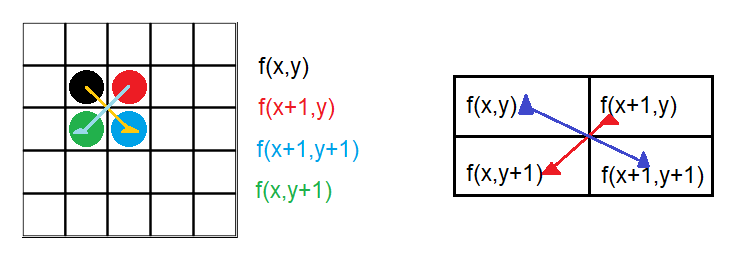
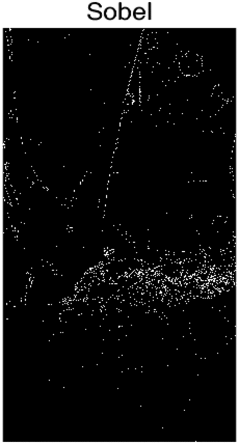
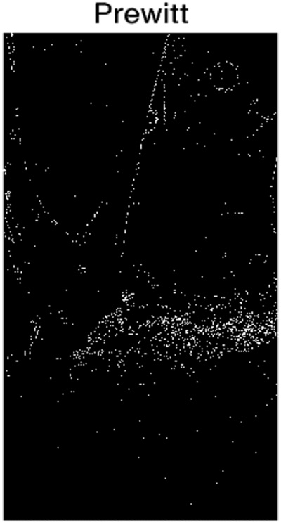
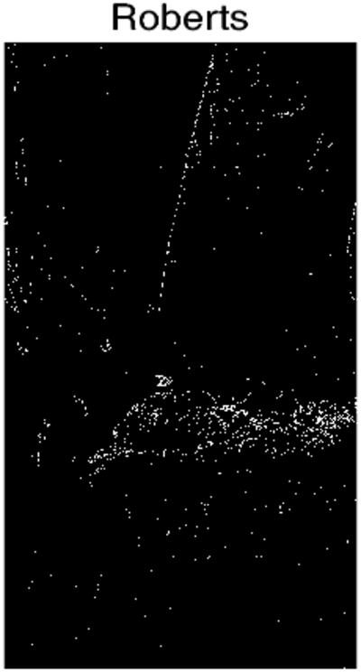
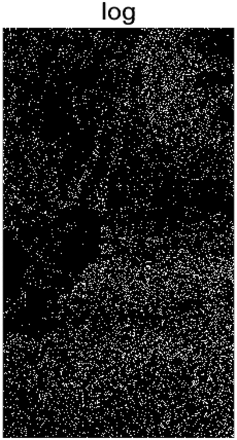
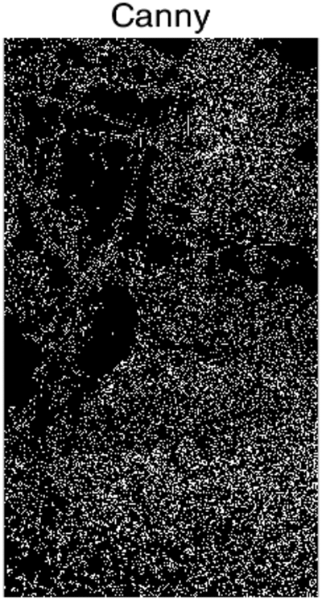

# Introducción 📖
Se propone realizar un programa que realice diferentes pruebas con los operadores de <a href="https://la.mathworks.com/help/images/ref/edge.html">edge</a> y proponer uno nuevo, pero antes de comenzar:

## ¿Qué es el procesamiento digital de imagenes (PDI)? 🤷‍♂️🤷‍
PDI se puede definir como el conjunto de procesamientos que se realizan sobre una imagen digital ya sea para realizar su almacenamiento, transmisión o tratamiento.

## Lectura de imágenes en matlab 👓
Para leer una imágen en matlab se utiliza la función <a href="https://la.mathworks.com/help/matlab/ref/imread.html"> **imread**</a> y se asigna a una variable que representara a la imágen.

<h5 align="center"><code>imagen = imread('ruta/nombre de la imágen.extensión');</code></h5>

## CONTRASTADO DE LA IMAGEN
Las técnicas de contrastación son útilies principalmente para resaltar los bordes en una imagen.

Existen métodos de contrastación en el dominio espacial y en el dominio de la frecuencia.

### El gradiente
El método más usado en la diferenciación de imágenes es el gradiente.

Se define el gradiente de una imagen $f(x,y)$ en el punto $(x,y)$ como el vector de dos dimensiones

$$G(f(x,y))= \begin{pmatrix}
G_x\\
\\
G_y
\end{pmatrix} = 
\begin{pmatrix}
\frac{\partial f}{\partial x}\\
\\
\frac{\partial f}{\partial y}
\end{pmatrix}$$

Una importante propiedad es que el vector gradiente $G$ apunta en la dirección de máximo cambio de $f$ en el punto $(x,y)$.

Para la detección de bordes sólo nos interesa la magnitud, que llamaremos simplemente gradiente y que denotaremos por:

$$G(f(x;y))$$

En una imagen digital las derivadas son aproximadas por diferencias; una de las aproximaciones que se suele hacer es:

$$G(f(x,y))=|f(x,y)-f(x+1,y-1)| + |f(x+1,y)-f(x,y+1)|$$

## OPERADOR SOBEL
Es uno de los operadores que calcula el gradiente de la intensidad de una imagen en cada pixel.

Da la magnitud del mayor cambio posible, la dirección de este y el sentido de oscuro a claro. El resultado muestra cómo de abruptamente o suavemente cambia una imagen en cada punto analizado y, en consecuencia, cuán probable es que éste represente un borde en la imagen y, también, la orientación a la que tiende ese borde.

Hay otros operadores que tienen el mismo principio, sólo cambia el valor de una variable dentro de las máscaras.

## OPERADORES DE PREWITT, SOBEL Y FREI-CHEN
Los tres operadores pueden formularse de forma conjunta con las siguientes máscaras de convolución mostradas a continuación:

$$
Gradiente Horizontal\\
\frac{1}{2+k} 
\begin{bmatrix}
1 & 0 & -1\\
k & 0 & k\\
1 & 0 & -1
\end{bmatrix}
$$

$$
Gradiente Vertical\\
\frac{1}{2+k} 
\begin{bmatrix}
-1 & -k & -1\\
0 & 0 & 0\\
1 & k & 1
\end{bmatrix}
$$

* Operador Prewitt (k=1)
* Operador Sobel (k=2)
* Operador Frei-Chen ($k=\sqrt{2}$)

La función <a href="https://la.mathworks.com/help/images/ref/edge.html">edge</a>, calcula el gradiente de intensidad de una imagen, permitiendo escoger entre diferentes operadores, como se muestra en el siguiente pseudocódigo:

~~~
S = edge(img,'sobel')
figure
imshow(S);title('sobel')
~~~

## FILTRO DE LA MEDIANA
Este filtro en general da mejores resultados que el filtro Gaussiano, porque permite preservar mejor los detalles y bordes.

Es muy útil en imágenes con ruido no uniforme.

Ordena los pixeles del vecindario y busca el valor de la media, ese es el valor que le asigna al pixel central.

### Resultados ⚗🧪

Se propuso usar 7 imagenes diferentes y probar los 7 metodos descritos en la documentación de matlab (los 7 metodos se aplicaron a cada imagen), a continuación se muestran los resultados obtenidos

<a href="https://github.com/ArturoEmmanuelToledoAguado/Edge/blob/main/Edge.m">Código</a>